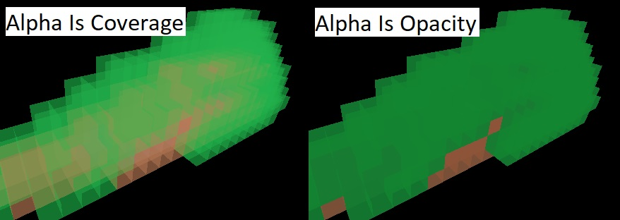
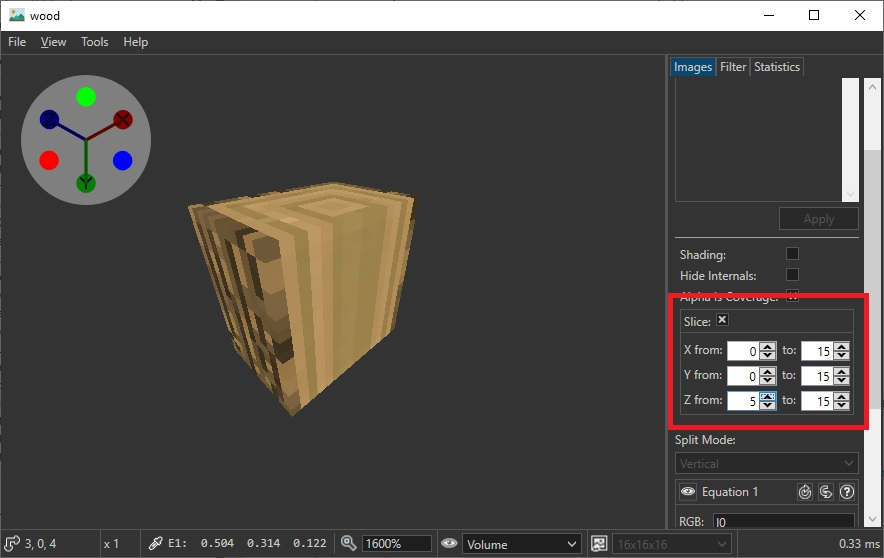

# 3D Textures

The image viewer support 3D textures from the dds and ktx file format. If you dont have 3D textures in the required format see [Creating 3D Textures](#Creating-3D-Textures).

## View Modes

After opening a 3D texture, they will be displayed in the "Volume" view (see status bar next to the eye icon). If you want to inspect only a single slice you can select the "Single" view and navigate through each slice with the "Silce Index" that can be set inside the "Images" tab on the right side.

The volume view provides the following display options:
* Shading: Enables simple flat shading


* Hide Internals (for Transparency):  Hides the insides of transparent areas so that only the hull is visible


* Alpha Is Coverage (for Transparency): When disabled, assumes that light loses colored instead of monochrome intensity when shinging through colored surfaces.



* Slice: Configures the range of displayed slices (cuts through the volume)



### Issues with Linear Interpolation
When enabling linear interpolation, a ray marching algorithm is used to determine the color. Possible Issues:
* Dark/Invalid Outlines: Those outlines can appear if the color channel of the texture is not correctly configured for fully transparent voxels (alpha = 0). In this case, the color of those invalid voxels bleeds over to non transparent voxels because linear interpolation is used. To fix this issue, apply the "fix_alpha" filter in the "Filter" tab.

## Creating 3D Textures

If you dont have the tools to create 3D dds or ktx textures you can use the image viewer to create a 3D textures from multiple 2D textures:
* Go to File->Import as Array/3D
* Drag your 2D textures into the list box
* Click "To Texture3D" to convert the seperate 2D textures into a merged 3D texture

Alternatively, you can convert a 2D texture array to a 3D texture via "Tools->Texture Array to Texture3D" after loading the texture array.

If you want to create a 3D texture programatically you can use [GLI](https://github.com/g-truc/gli) to create dds/ktx files. This is a minimal example on how to create and save 3d textures:

```c++
#include <gli/gli.hpp>

int main() {
   // 3d texture with rgba 8 bit srgb format, 32x32x32 resolution and 1 mipmap
   gli::texture3d tex(gli::format::FORMAT_RGBA8_SRGB_PACK8, gli::extent3d(32, 32, 32), 1);

   // raw access to pixels 
   uint8_t* pixels = reinterpret_cast<uint8_t*>(tex.data());
   // set pixel at (0, 0, 0) to white (0xFFFFFFFF)
   tex.store({ 0, 0, 0 }, 0, 0xFFFFFFFF;);

   gli::save_dds(tex, "volume.dds");
   return 0;
}
```
